# 📊 Diagramas de Lógica de Negócio — Sistema de Comissões

> **Versão:** 1.0 — Março/2026  
> **Base:** `DOCUMENTACAO_COMPLETA_SISTEMA_COMISSOES.md` v1.1 + código auditado  
> **Uso:** Copie cada bloco `mermaid` individualmente para o [Mermaid Live Editor](https://mermaid.live) ou visualize no GitHub/VS Code.

---

## 1. Fluxo Geral do Sistema (Visão Macro)

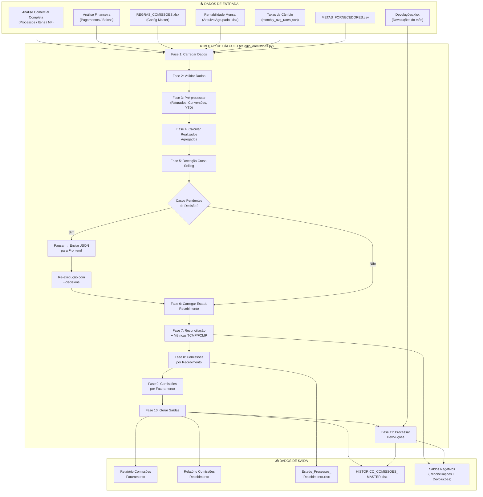

---

## 2. Cálculo de Comissão por Faturamento (Item a Item)

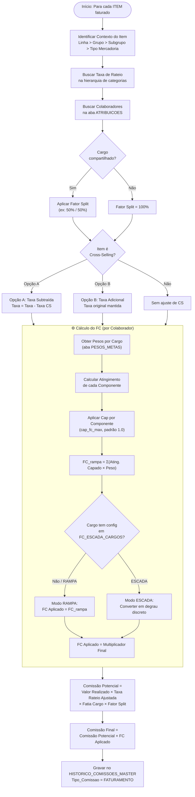

---

## 3. Componentes do Fator de Correção (FC)

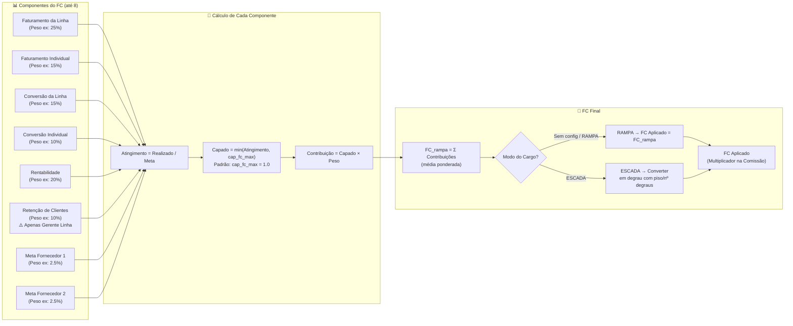

---

## 4. FC Escada — Lógica de Degraus

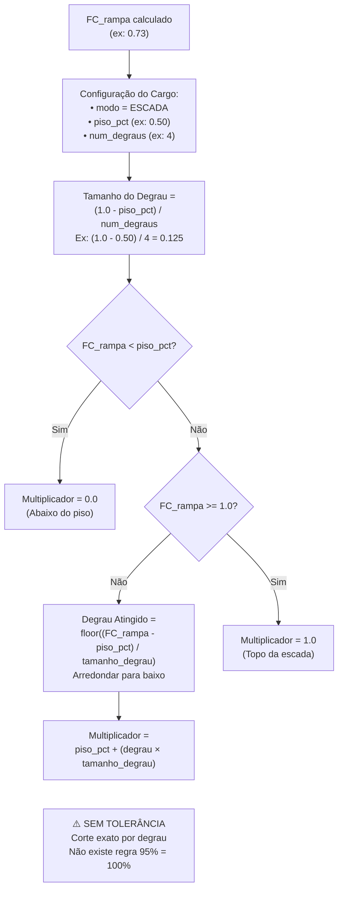

---

## 5. Fluxo de Comissões por Recebimento

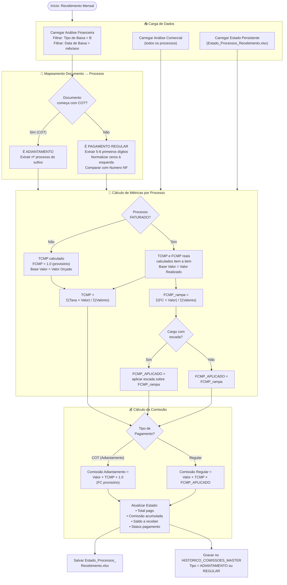

---

## 6. Detecção de Cross-Selling

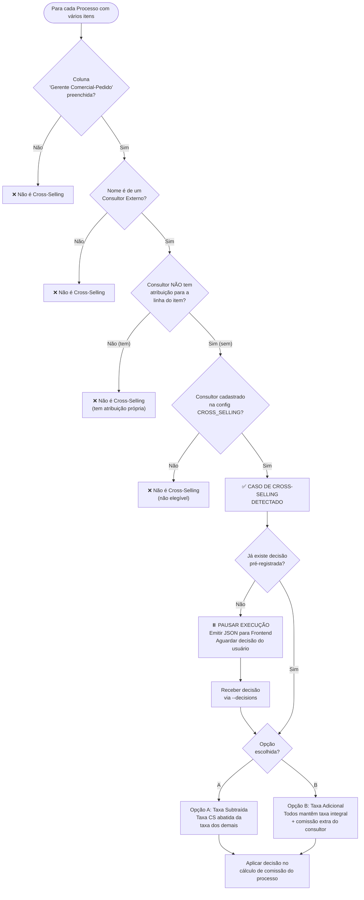

---

## 7. Adiantamentos e Reconciliação

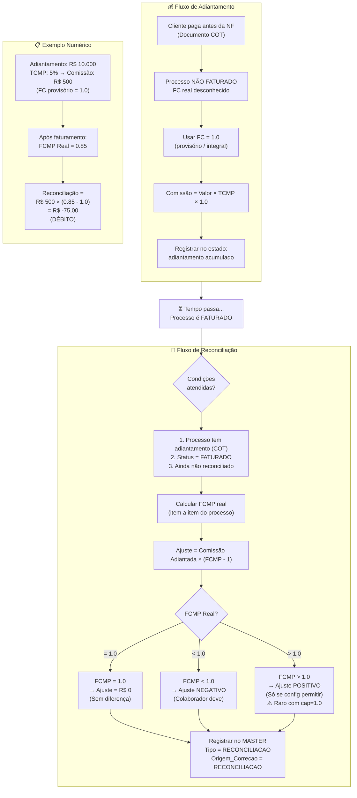

---

## 8. Processamento de Devoluções

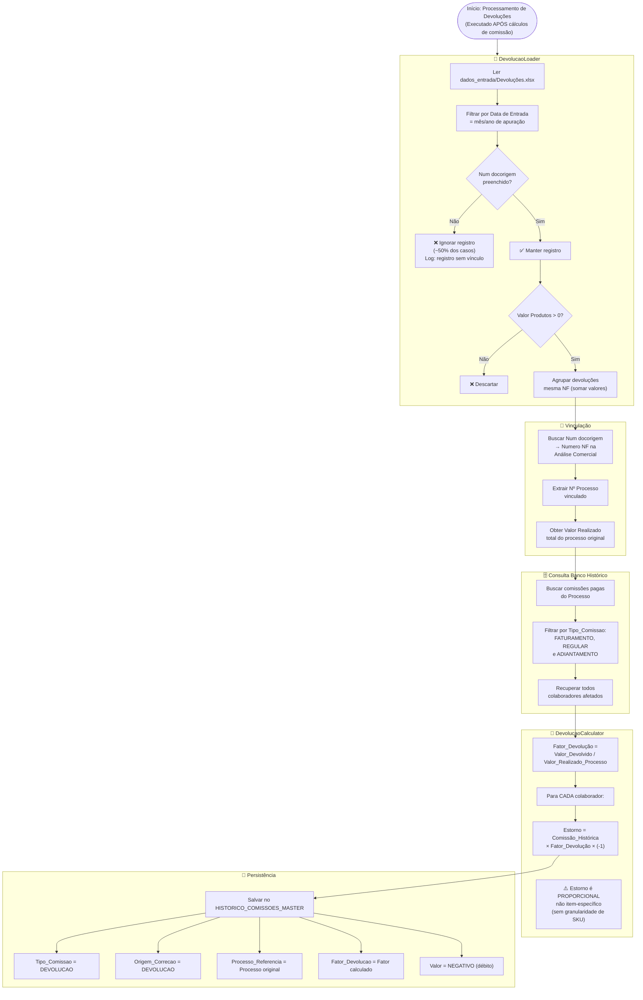

---

## 9. Rentabilidade — Componente do FC

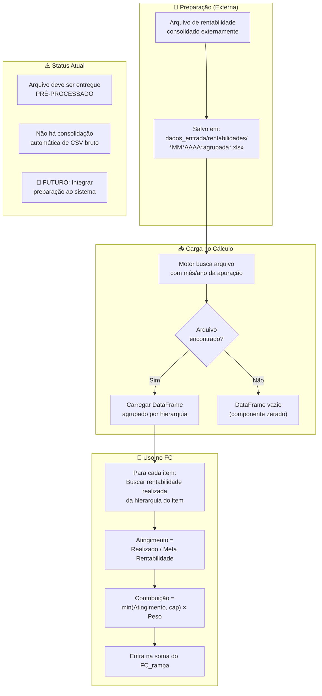

---

## 10. Taxas de Câmbio — Fornecedores

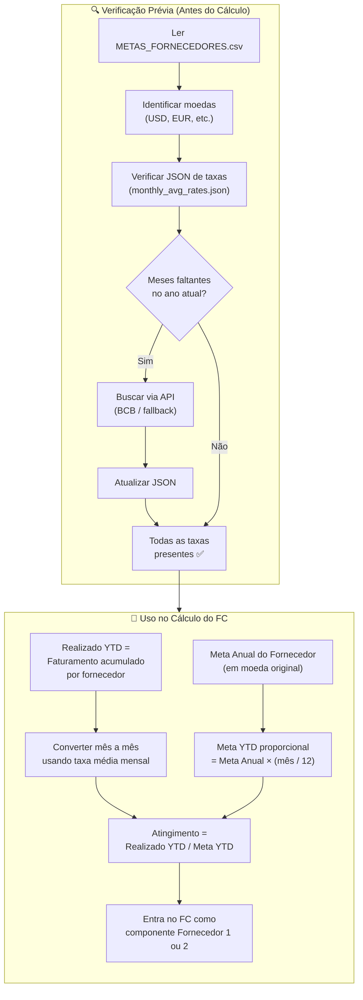

---

## 11. Estado Persistente de Recebimento

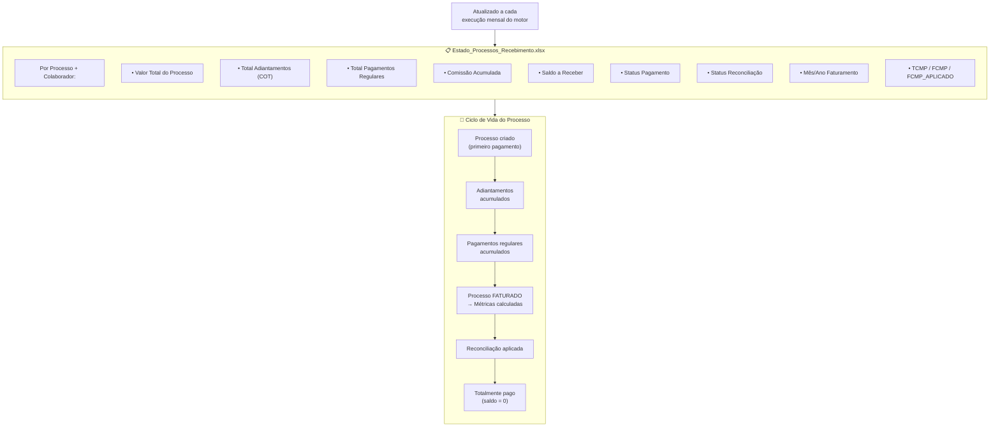

---

## 12. Banco Histórico (HISTORICO_COMISSOES_MASTER.xlsx)

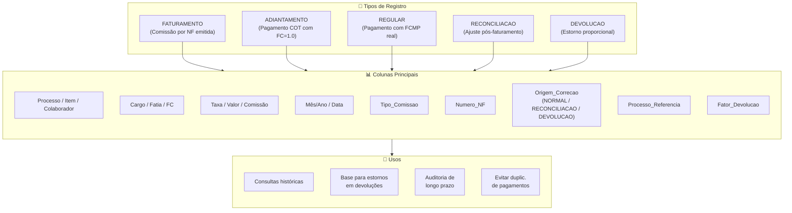

---

## 13. Mapa de Decisão do Usuário (Frontend)

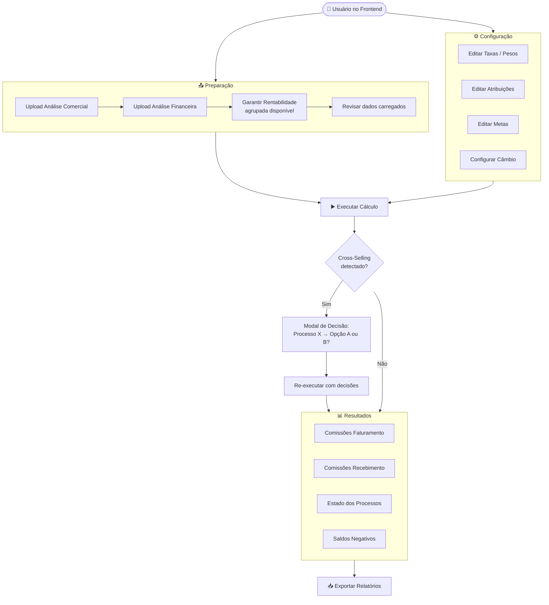

---

## 14. Diagrama de Saldos Negativos (Consolidação)

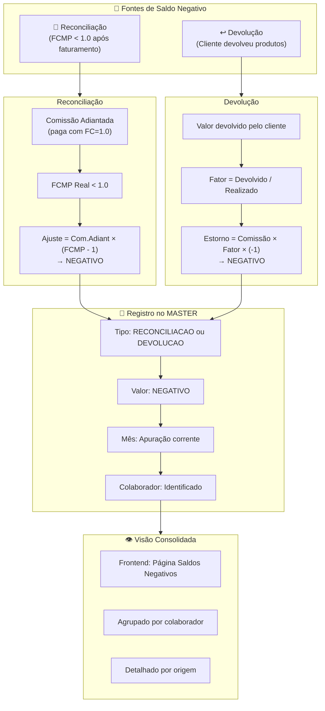

---

## 15. Mapa de Módulos do Código (Arquitetura)

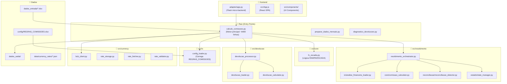

---

## 16. ⚠️ Pontos de Atenção / Oportunidades de Melhoria

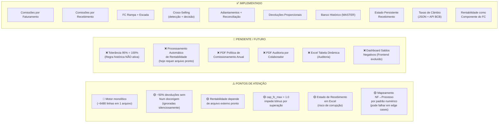

---

> **Como usar este arquivo:**
> 1. Abra [mermaid.live](https://mermaid.live) ou use a extensão Mermaid no VS Code
> 2. Copie o conteúdo entre os blocos ` ```mermaid ` e ` ``` ` de cada seção
> 3. Cole no editor para gerar a visualização
> 4. Os diagramas são independentes — cada um cobre um aspecto do sistema
